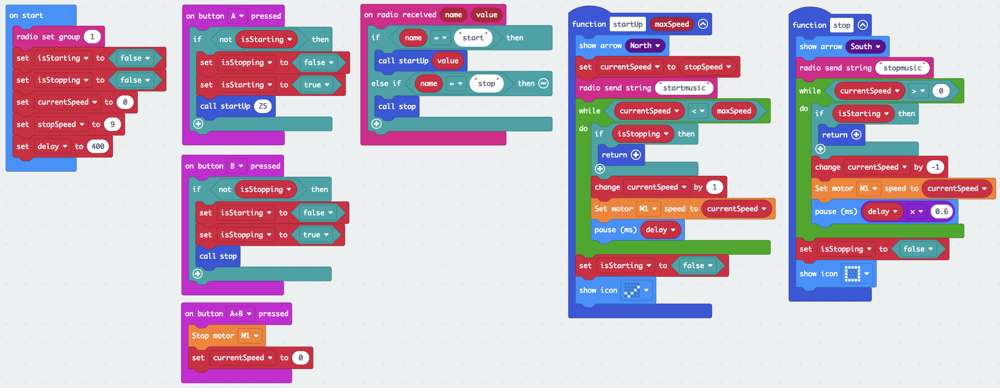

# Lego Carousel Program

This program is for the carousel itself and allows the motor to speed up and slow down progressively using a while loop and a delay. The delay is set to 400 ms for the speed up. It was found that it takes longer to slow down so the delay is multiplied by 0.6.

The carousel can be started and stopped from its own micro:bit with the A and B buttons. This logic includes an interlock so that the carousel can be stopped before it finishes starting. The event issue described on the project page meant that if the A button was pressed twice followed by the B button, the carousel would begin to slow down and then would speed up again. The interlock prevents this issue.

Also available:

* [Python](Lego-Carousel.py)
* [Javascript](Lego-Carousel.js)